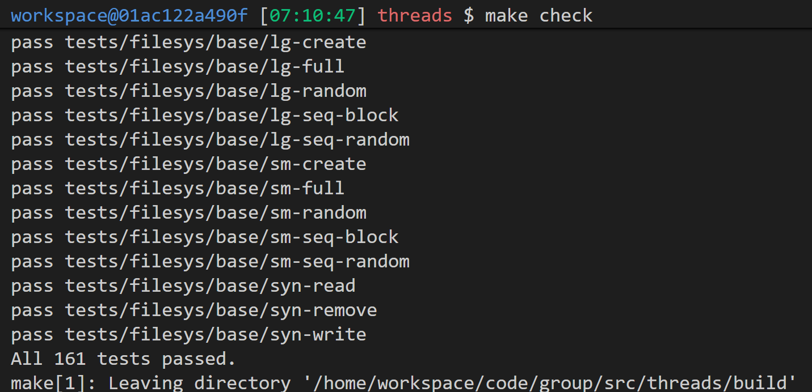

# Project Threads Design
Group -1
| Name | Autograder Login | Email |
| ---- | ---------------- | ----- |
|   114   |        514          |  dvd123@ruc.edu.cn     |
|   seg   |    fault              |  dvd123@ruc.edu.cn     |
|   Legendary   |  Grandma_ster                |  dvd123@ruc.edu.cn     |
|   逸一时  |     误一世             |  dvd123@ruc.edu.cn     |

----------
***Read comments in code for more implementation detial***

# Efficient Alarm Clock
## Data Structures and Functions
- `struct thread`: Added `int64_t wakeup_ticks` to store the specific tick count at which the thread should wake up.
- `static struct list ac_sleeping_list`: A global list that stores all threads currently in a sleep state, waiting for the timer.
- `static bool ac_less(const struct list_elem* a, const struct list_elem* b, void* aux)`: A comparator function used to keep `ac_sleeping_list` sorted in ascending order of `wakeup_ticks`.
- `static void check_ac_list(int64_t cur_ticks)`: Iterates through the sleeping list to find threads whose wakeup time has arrived or passed.

## Algorithms
### Sleeping (`timer_sleep`)
When a thread requests to sleep for a specific duration, I first calculate its absolute wakeup time (`current_ticks + ticks`) and store this in the thread's `wakeup_ticks` member. Instead of busy-waiting or yielding repeatedly, we place the thread onto the `ac_sleeping_list`. Crucially, I use `list_insert_ordered` with the `ac_less` comparator to maintain the list sorted by wakeup time. Once inserted, the thread is put to the blocked state using `thread_block()`. This removes it from the ready queue until it is explicitly unblocked.

### Waking Up (`timer_interrupt` and `check_ac_list`)
The `timer_interrupt` handler runs on every tick. Inside this handler, I call `check_ac_list(ticks)`.
Since `ac_sleeping_list` is sorted by wakeup time, this function only needs to inspect the front of the list:
1. Get the thread at the front of the list.
2. Check if its `wakeup_ticks` is less than or equal to the current `ticks`.
3. If yes, remove it from the list and call `thread_unblock()`, making it ready to run again. Repeat for the new head of the list.
4. If no (the head thread is not ready to wake up), I immediately return. Because the list is sorted, if the first thread isn't ready, no subsequent threads are ready either.

## Synchronization
### Shared Resources
- `ac_sleeping_list`: Accessed by threads calling `timer_sleep` and the `timer_interrupt` handler.
- `struct thread` (specifically `wakeup_ticks` and `elem`): Modified by the owner thread and accessed by the interrupt handler.

### Strategy
I ensure safety by **disabling interrupts** inside `timer_sleep`.
- **Reasoning:** The `check_ac_list` function is called from `timer_interrupt`, which runs in an external interrupt context. external interrupt handlers cannot acquire locks (semaphores/mutexes). Therefore, the only way to prevent the interrupt handler from corrupting the list while a thread is inserting itself is to disable interrupts before accessing the list in `timer_sleep` and re-enable them after `thread_block` returns.
- **Concurrency Impact:** Disabling interrupts is a coarse-grained approach, but the critical section in `timer_sleep` is very short (one ordered list insertion and a block call).

## Rationale
### Ordered List vs. Unordered List
I chose to keep the `ac_sleeping_list` sorted by `wakeup_ticks`.
- **Insertion Cost:** $O(N)$, where $N$ is the number of sleeping threads.
- **Wakeup/Check Cost:** $O(1)$ to check if no threads need waking, or $O(K)$ where $K$ is the number of threads waking up this tick.
- **Alternative:** An unordered list would make insertion $O(1)$ but checking would be $O(N)$ every single tick.
- **Justification:** I prioritize minimizing work inside the interrupt handler (`timer_interrupt`). Doing $O(N)$ work every tick in an timer interrupt handler consumes CPU cycles even when no threads are waking up. By shifting the work to the `timer_sleep` (insertion), we penalize only the thread going to sleep, while keeping the system-wide interrupt overhead minimal.

----------
# Strict Priority Scheduler

## Data Structures and Functions

### `struct thread` Modifications
- `int base_priority`: Stores the thread's original priority, separate from the temporary donated priority.
- `struct list lock_held`: A list of locks currently held by this thread; used to calculate effective priority.
- `struct lock *lock_waiting`: The lock this thread is currently waiting for; used to traverse the dependency chain for nested donation.
- `struct list *waiting_list`: A pointer to the specific list this thread is currently inside; used to re-sort the thread after priority changes.

### Synchronization Structures (`synch.c`)
- `struct semaphore_elem`: A wrapper struct used in condition variables to associate a semaphore with a specific waiting thread.
- `static bool sema_prio_more(...)`: A comparator function used for condition variables to ensure `semaphore_elem`s are sorted by the priority of their associated threads.

### Functions
- `bool thread_prio_more(...)`: Comparator function that returns true if thread A has a higher priority than thread B.
- `void update_priority(struct thread* t)`: Recalculates a thread's effective priority by finding the maximum priority among all threads waiting on locks held by `t`.
- `void donate_priority(struct thread* from)`: Propagates priority donation recursively up the chain of lock holders (nested donation).

## Algorithms

### Choosing the Next Thread
I maintain the `prio_ready_list` in sorted order at all times.
- **Insertion:** In `thread_enqueue`, I use `list_insert_ordered` with the `thread_prio_more` comparator. If priorities are equal, the new thread is inserted after existing ones, ensuring Round-Robin behavior for ties.
- **Scheduling:** The `thread_schedule_prio` function simply removes the front element of the list, which is guaranteed to be the highest-priority thread.

### Semaphores and Locks
- **Waiting (`sema_down`):** When a thread waits on a semaphore (or lock), it is inserted into the `sema->waiters` list using `list_insert_ordered`. This ensures that the list is always sorted by priority. I also record `t->waiting_list = &sema->waiters` so I can re-sort this specific list if the thread's priority changes while waiting (due to donation).
- **Waking (`sema_up`):** Pop the front thread from `sema->waiters`. Since the list is sorted, this is the highest priority waiter.
- **Preemption on Wake:** Immediately after unblocking the waiter in `sema_up`, I check if the newly woken thread has a higher priority than the current running thread. If so, call `thread_yield()` (or `intr_yield_on_return` if in an interrupt context) to ensure immediate execution of the higher priority thread.

### Condition Variables
- **Waiting (`cond_wait`):** I use `struct semaphore_elem` to create a local semaphore for the waiting thread. These elements are inserted into `cond->waiters` using `list_insert_ordered` with the `sema_prio_more` comparator. This ensures that the condition variable's wait queue is sorted by thread priority.
- **Signaling (`cond_signal`):** Pop the first `semaphore_elem` from `cond->waiters` and `up` its semaphore. This guarantees that the highest priority thread waiting on the condition is the one signaled.

### Priority Donation
**Acquiring a Lock (`lock_acquire`):**
1. Before waiting on the semaphore, check if the lock is held.
2. If held, check if the holder has a lower priority than the current thread.
3. If yes, call `donate_priority(current_thread)`. This function traverses the chain (`current -> lock -> holder -> lock -> ...`) and raises the priority of every thread in the chain to match the current thread's priority.
4. If a thread's priority is raised and it is currently in a `waiting_list` (e.g., waiting on another lock), we remove it and re-insert it (`list_insert_ordered`) to maintain the sorted order of that list.

**Releasing a Lock (`lock_release`):**
1. The lock is removed from the thread's `lock_held` list.
2. call `update_priority(current_thread)`.
3. This function resets the priority to `base_priority` and then iterates through the remaining `lock_held` list. For each lock, it checks the front of that lock's waiters list (which is sorted) and applies the maximum priority found to the current thread.

## Synchronization

### Shared Resources
- `prio_ready_list`: Modified by scheduling functions and priority donation logic.
- `struct thread` fields (`priority`, `lock_held`, `lock_waiting`, `waiting_list`): Accessed by the thread itself and by other threads donating priority to it.
- `sema->waiters` and `cond->waiters`: Modified by threads waiting and signaling/releasing.

### Strategy
I ensure safety by **disabling interrupts** (`intr_disable`) whenever I access or modify these shared lists or thread priority fields.
- **Atomicity in Donation:** Priority donation modifies the priority and list position of *other* threads (the lock holders). By disabling interrupts, I ensure that a lock holder is not scheduled or interrupted while we are midway through updating its priority or moving it between lists.
- **List Integrity:** Operations like `sema_down` and `cond_wait` involve complex list manipulations (ordered insertion). Disabling interrupts ensures these operations are atomic and prevents race conditions where an interrupt handler might try to wake a thread that is only partially inserted into a list.

## Rationale

### Eager Priority Updates vs. Lazy Evaluation
I chose an **eager** approach where I update priorities and resort lists immediately when a lock is acquired, released, or a thread calls `thread_set_priority`.
- **Pros:** The `schedule` and `sema_up` functions remain fast (just pop front). The high-priority thread is guaranteed to run as soon as possible.
- **Cons:** Higher overhead during lock operations ($O(N)$ for list insertion).
- **Why better:** In a real-time or strict priority system, scheduling latency is critical. Moving the complexity to the synchronization primitives ensures the scheduler path remains fast and deterministic.

### Handling Nested Donation
I iterate up the chain of lock holders to support nested donation.
- **Alternative:** We considered only donating to the direct holder.
- **Shortcoming:** This leads to priority inversion if the direct holder is blocked on yet another lock held by a low-priority thread.
- **Solution:** My recursive (iterative loop) approach ensures that the high priority effectively "tunnels" through the dependency chain to the thread actually blocking progress. I use a depth limit (`MAX_DONATE_LEVEL`) to prevent infinite loops.

----------
# User Threads

## Data Structures and Functions

### `struct process` (Process Control Block)
- `struct lock pcb_lock`: A global lock to protect shared data within the PCB (file descriptors, child lists, thread lists, etc.).
- `struct bitmap* stack_map`: A bitmap used to manage user stack allocation. Each bit represents a page-sized stack slot in the user virtual address space.
- `struct list thread_list`: A list of `struct thread_info` used to manage `pthread_join`.
- `int active_thread_cnt`: A counter to track how many threads are currently running. Used to determine when the process should terminate.
- `bool exiting`: A boolean flag indicating if the process is currently terminating. 
- `struct lock* user_locks[MAX_USER_LOCKS]`: An array storing pointers to kernel `struct lock`s, indexed by IDs given to user space.
- `struct semaphore* user_semas[MAX_USER_SEMAS]`: An array storing pointers to kernel `struct semaphore`s.
- `struct semaphore main_wait`: Used for synchronization in phread_exit_main, wake up main thread after all the other threads exit.
### `struct thread`
- `size_t stack_idx`: the page slot index of the user stack.

### `struct thread_info`
A lightweight structure used to handle the synchronization of `pthread_join`.
- `tid_t tid`: The Thread ID associated with this info.
- `struct semaphore sema`: The semaphore that a joiner waits on. The target thread "ups" this semaphore upon exit.
- `bool joined`: A flag to indicate if this thread has already been successfully joined.

### Functions
- `tid_t pthread_execute(stub_fun sf, pthread_fun tf, void* arg)`: Handles the creation of a new kernel thread, initialization of arguments, and synchronization with the start of the user thread.
- `void pthread_exit(void)`: Handles the cleanup of a single user thread, including freeing its stack and signaling any joiners.
- `void intr_handler(struct intr_frame* frame)`: Modified to check the `pcb->exiting` flag. If a thread traps from userspace and the flag is set, it terminates immediately.

## Algorithms

### Thread Creation (`pthread_execute`)
1.  **Initialization:** I allocate a `pthread_init_status` structure to pass arguments and the parent's `pcb` to the new thread.
2.  **Creation:** Call `thread_create` with a new start function `start_pthread`, allocate stack.
3.  **Stack Allocation and arguments pushing:** `start_pthread` calls `setup_thread`. Inside `setup_thread`, Creates a new stack for the thread and sets up its arguments
4.  **Synchronization:** The parent waits on a semaphore until `start_pthread` indicates success or failure.

### Thread Joining (`pthread_join`)
1.  **Lookup:** Acquire `pcb_lock` and search `pcb->thread_list` for the `thread_info` corresponding to the target TID.
2.  **Validation:** Check if the thread exists and hasn't been joined yet.
3.  **Waiting:** Release the lock and call `sema_down` on `thread_info->sema`. This blocks the caller until the target thread exits.

### Normal Thread Exit (`pthread_exit`)
This function is called by non-main threads.
1.  **Stack Cleanup:** I identify the current thread's stack index, clear the corresponding bit in `pcb->stack_map`, and free the associated physical page and page table entry (`pagedir_clear_page`).
2.  **Signal Joiners:** Find `thread_info` in the PCB and call `sema_up(&t_info->sema)` to wake up any thread waiting to join it.
3.  **Update Count:** Decrement `pcb->active_thread_cnt`.
4.  **Signal Main:** If `pcb->main_exiting` is true (meaning main is waiting for us) and `active_thread_cnt` has dropped to 1 (we are the last worker), we call `sema_up(&pcb->main_wait)` to wake up the main thread.
5.  **Kernel Exit:** Finally, we call `thread_exit()` to destroy the kernel thread struct.

### Main Thread Exit (`pthread_exit_main`)
This function is called specifically when the main thread calls `pthread_exit`.
1.  **Set Flag:** I acquire `pcb_lock` and set `pcb->main_exiting = true` to inform worker threads that main is waiting.
2.  **Signal Joiners:** Just like a normal thread, I signal anyone waiting to join the main thread.
3.  **Wait for Workers:** I check `active_thread_cnt`. While it is greater than 1 (meaning other threads are still running), release the lock and wait on `pcb->main_wait`.
4.  **Process Termination:** Once woken up (count is 1), the main thread proceeds to call `process_exit()` to clean up the entire process.

### Process Termination (`sys_exit` and `intr_handler`)
I implement a "lazy" termination strategy to handle `exit()` in a multithreaded environment.
1.  **Initiator:** When a thread calls `sys_exit`, it sets `pcb->exiting = true`. It acts as the "winner," waking up all waiting joiners (`sema_up` on all thread infos) to ensure no thread sleeps forever.
2.  **Peers (The Check):** Other threads in the process continue running until they experience an interrupt (timer, syscall, etc.) and is about to comming back to user space.
3.  **Enforcement:** Inside `intr_handler`, I check `is_trap_from_userspace(frame)`.
    - If the interrupt originated from userspace (or is about to return to it) AND `pcb->exiting` is true, the thread does not return to user mode.
    - Instead, it decrements `active_thread_cnt`, calls `thread_exit()`, and dies.
4.  **Last Thread:** The last thread to exit (count reaches 0) calls `clean_up_process()` to free file descriptors and other PCB resources, and `sema_up` the parent process if necessary.

## Synchronization

### Shared Process Resources
All threads in a process share the `struct process` (PCB).
- **Process Exit Flag:** The `exiting` flag is the primary synchronization signal for process termination. It is protected by `pcb_lock` during the initial set, but read atomically in `intr_handler`.
- **Active Thread Count:** decremented in `intr_handler`. Since external interrupts have interrupts disabled, I modify the count directly. For internal interrupts (syscalls), I acquire `pcb_lock` to ensure atomicity.

### Safety in Interrupt Handler
The `intr_handler` must be extremely careful when terminating a thread.
- **External Interrupts (Timer/Device):** Interrupts are already disabled. I check `is_trap_from_userspace`. If exiting, decrement the count. If it hits 0, I explicitly re-enable interrupts before calling `clean_up_process` (to allow potential I/O or lock acquisition during cleanup) and then exit.
- **Internal Interrupts (Syscalls):** I acquire `pcb_lock` before modifying shared PCB state to prevent race conditions with other threads running or preemption.

## Rationale

### Termination via Interrupts vs. Forced Killing
We chose to let threads "commit suicide" in `intr_handler` rather than having the exiting thread traverse the thread list and forcefully kill peers.
- **Resource Leaks:** Forcefully killing a thread (e.g., `thread_kill`) is dangerous if that thread holds kernel locks (like `filesys_lock`) or is in the middle of a memory allocation.
- **Safe Points:** By checking `exiting` only when `is_trap_from_userspace` is true, I guarantee the thread is at a "safe point" (boundary between user and kernel). This ensures that any ongoing kernel operation (like a disk read) finishes before the thread terminates.
- **Assumption:** This relies on the project assumption that "a user thread entering the kernel never blocks indefinitely."

----------

# Test case for smfs(fair schedualing, this test case is in `make check` locally)
- I don't know what it is, since the project requirements in 25Fall doesn't mention this. I implement it though.
- I used stride schedualing, look my code for more details.
- I change the `time_sleep(200000)` to `time_sleep(2000)` in test `smfs-hierarchy-*`, since the 200000 will definately exit the time limit 60s of the test, I don't know how to solve it if don't change it to 2000.
- 
# Concept check
trivial, skipped
1. 
2. 
3.  
4.  
5.  

