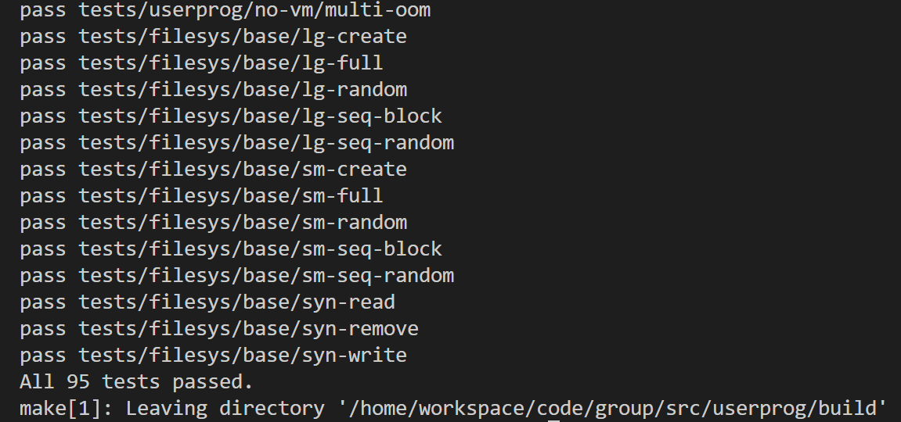

# Project User Programs Design
Group 114514

| Name | Autograder Login | Email |
| ---- | ---------------- | ----- |
|   Peter Griffin   |   Bird_is_a_Word               |    dvd123@ruc.edu.cn  |
|  Doomfist    |      K.O            |    dvd123@ruc.edu.cn  |
|    Baby Yoda  | "May the Schwartz be with you."                 |    dvd123@ruc.edu.cn  |
|  Jam a man of fortune,     |    and J must seek my fortune              |    dvd123@ruc.edu.cn  |

----------



# Argument Passing
## Data Structures and Functions
### Modified / Added Functions
- `bool load(char* file_name, void (**eip)(void), void** esp)`
  Handles loading ELF executable and performs argument parsing before creating the user stack.
  Modified to tokenize `file_name` using `strtok_r()` and store parsed arguments in `argv[]`.

- `static bool setup_stack(void** esp, int argc, char** argv)`
  Rewritten to setup stack and push arguments onto the stack. Handles padding, address alignment, and stack pointer arithmetic to build a standard C-style main(argc, argv) stack layout. Used `ROUND_DOWN()` from `ROUND.h' to ensure stack padding meets 16-byte alignment.

### Structs and Variables
- `struct init_status`
  A struct passed by parent to child, contains information 
  for the child to initialize stuff.
  ```cpp
  struct init_status {
    /* Used in process_fork */
    struct thread* parent;
    const struct intr_frame* if_;
    /* Used in process_execute */
    char* file_name;
    /* Semaphore used to synchronize process_execute */
    struct semaphore load_sema; 
    bool load_success;
    struct list* list_of_parent;
  };
  ```

- `#define MAX_ARGC`
  Defined in header to limit the maximum number of arguments (argv) to prevent unbounded stack growth and ensure safe copying.

- `char* argv[MAX_ARGC]`
  Temporary array used in load() to hold argument pointers parsed from the command line before being pushed into user memory.

- `char* user_argv[MAX_ARGC]`
  Temporary kernel-space array in setup_stack() that stores user-space addresses of each copied argument string, used later to construct the argv[] array on user stack.

- use thread safe function `strtok_r` to parse the input into arguments.
- change `setup_stack`'s signature to `static bool setup_stack(void** esp, int argc, char** argv)`, therefore this funcition create a stack and push arguments onto the stack.

## Algorithms
### Overview
The implementation can be broken down into three main stages:

1. `prcocess_execute` accept `file_name` and initialize `init_st` which contains informaiton for further loading, and pass it to `start_process`.
2. Tokenizing the command line in `load`:
  ```cpp
  char* saveptr = NULL;
  argv[0] = strtok_r(file_name, " ", &saveptr);
  while ((argc < MAX_ARGC) && (token = strtok_r(NULL, " ", &saveptr)) != NULL)
    argv[argc++] = token;
  ```
  The kernel safely tokenizes file_name using strtok_r() (thread-safe) to extract the program name and arguments. This avoids global state issues in non-reentrant strtok(). Each token is stored in argv[], and the count in argc is incremented. Argument count limit is enforced by MAX_ARGC to avoid buffer overflow.

3. Setting up the stack in `setup_stack`. The function `setup_stack(void **esp, int argc, char **argv)` builds the user stack layout in memory mentioned in pintos doc as follows:
  1. Allocate a zero-initialized page at PHYS_BASE - PGSIZE and install it using install_page().
  2. Set the initial stack pointer *esp = PHYS_BASE.
  3. Copy argument strings in reverse order so that they appear contiguously below PHYS_BASE, each null-terminated.
  4. Record each string’s user-space address in user_argv[i].
  5. Compute total stack usage (args_size), calculate 16-byte padding.
   and push zero bytes to align the stack.
  6. Push all argument pointers (user_argv[i]) in reverse order.
  7. Push the address of the argv array itself.
  8. Push argc, then a dummy return address (0).

  
### Edge cases and validations
- Reject empty filenames (argv[0] == NULL) early in load().
- Reject overly long argument lists (argc >= MAX_ARGC).
- Check that every stack push operation keeps esp > PHYS_BASE - PGSIZE.
- Print debug message if setup_stack runs out of space.
## Synchronization

The argument parsing and stack setup occur entirely in the context of a single thread during process initialization, before the thread is unblocked or any other thread runs concurrently. Thus:
- No shared data is accessed concurrently.
- No synchronization primitives (locks, semaphores, etc.) are required for this step.
- The only shared global structure potentially touched is the file system (`filesys_open()`), which is separately synchronized using `filesys_lck` and a semaphore used for `process_execute`, which will be mentiond in the next task.

Therefore, argument passing itself is race-free.
## Rationale
- I'm lazing to write this part
----------

# Process Control Syscalls
## Data Structures and Functions
### Structures

#### `struct init_status`
Stores information required during process initialization and loading. It is dynamically allocated by the parent in `process_execute()` and freed after the child finishes loading (via `sema_up()`).
- `char *file_name`: the program name and arguments string.
- `struct list *list_of_parent`: pointer to parent’s `child_list`, used to add child’s `wait_status`.
- `struct semaphore load_sema`: used to synchronize between parent and child on load completion.
- `bool load_success`: indicates whether the child successfully loaded its executable.
- `struct thread *parent`: used in `process_fork()` to copy the parent’s context.
- `const struct intr_frame *if_`: used by `fork` to duplicate the register state.

#### `struct process`
Represents a process control block (PCB). Each thread that represents a user process owns one.
- `uint32_t *pagedir`: the process’s page directory.
- `struct thread *main_thread`: the main kernel thread running this process.
- `char process_name[16]`: executable name.
- `struct wait_status *wait_st`: pointer to this process’s wait status.
- `struct list child_list`: list of children’s `wait_status` objects.
- `struct file *fd_table[MAX_FDS]`: file descriptor table.
- `struct file *exec`: pointer to the executable file (write-denied while running).

#### `struct wait_status`
A shared object between a parent and a child to support `wait()` and exit synchronization.
- `pid_t pid`: child process ID.
- `int exit_code`: exit status set by the child on termination.
- `struct semaphore wait_sema`: allows the parent to block in `wait()`.
- `bool waited`: indicates whether the parent has already called `wait()` for this child.
- `int ref_cnt`: reference count, initially 2 (one for parent, one for child).
- `struct lock lck`: used to synchronize access to `ref_cnt`.
- `struct list_elem elem`: embedded list element for insertion into parent’s child list.

---

### Functions Overview

#### User Memory Access Helpers
Based on Pintos’ recommended second approach using inline assembly `get_user()` / `put_user()`.
Implemented additional wrappers for safer multi-byte reads and validations:
- `static bool get_user_dwords(uint32_t *dst, const uint8_t *uaddr)`  
  Safely reads a 4-byte integer from user memory into `dst`. Returns false if invalid.
- `static bool check_user_buf(const uint8_t *uaddr, size_t size)`  
  Validates that a user buffer `[uaddr, uaddr+size)` is readable.
- `static int check_user_str(const uint8_t *uaddr, size_t size)`  
  Validates a null-terminated string (max `size`), returns string length if valid.

These are used throughout `syscall_handler()` to safely fetch syscall arguments before using them.

#### Process Creation and Execution
- **`pid_t process_execute(const char *file_name)`**  
  Creates a new kernel thread to execute the user program.  
  Synchronizes with the child via `init_status.load_sema` to ensure the parent only returns after the child finishes loading.  
  Returns TID on success, `TID_ERROR` on failure.

- **`static void start_process(void *aux)`**  
  Child thread’s entry function.  
  Loads the ELF executable, builds user stack, initializes PCB and wait status, then enters user mode using `intr_exit`.  
  If loading fails, it cleans up and terminates via `thread_exit()`.

- **`int process_wait(pid_t child_pid)`**  
  Searches the parent’s `child_list` for the matching child’s `wait_status`.  
  If found and not already waited upon, calls `sema_down()` on its `wait_sema` to block until child exit.  
  Returns the child’s `exit_code`, or `-1` on invalid PID or double wait.

- **`void process_exit(void)`**  
  Prints exit status, signals parent via `sema_up()`, destroys page directory, closes open files, and frees PCB and wait_status when reference count reaches zero.  
  Also frees all child `wait_status` structures.

- **`pid_t process_fork(const struct intr_frame *if_)`**  
  Creates a copy of the current process, including PCB, file descriptors, and page table.  
  Uses the same `init_status` synchronization scheme.  
  Calls `copy_page_table()` to perform a deep copy of all user pages.  
  Returns new TID on success, `TID_ERROR` otherwise.

---

### System Call Interface Functions
Located in `syscall.c`, connected to interrupt `0x30`.

- **`sys_exit(int status)`**:  
  Sets the process’s `exit_code` and invokes `process_exit()` to terminate.  

- **`sys_exec(const char *cmd_line)`**:  
  Validates user string using `check_user_str()` and calls `process_execute()`.

- **`sys_wait(pid_t pid)`**:  
  Calls `process_wait(pid)` directly.


## Algorithms
### User Memory Access

Each system call first checks the validity of all user-provided pointers.  
The handler sequence is:
1. Use `get_user_dwords()` to fetch syscall number and arguments from `f->esp`.
2. Validate each argument using `check_user_str()` or `check_user_buf()`.
3. On invalid access → immediately call `sys_exit(-1)` to kill the offending process.

This approach prevents page faults inside the kernel. Noth that `page_fault` in `exception.c` is changed
according to the 2nd memory access approach in pintos doc.

---
### `practice` and `halt` is easy and trivial

---

### `exit` Algorithm

When `sys_exit(status)` is called:
1. The child sets its own `wait_st->exit_code = status`.
2. Calls `process_exit()`:
   - Prints exit message.
   - Signals the parent’s `wait_sema`.
   - Closes open file descriptors and executable.
   - Decrements and frees its own `wait_st` and children’s `wait_status` entries if reference count reaches zero.
   - Destroys page directory and PCB.
3. Terminates the thread via `thread_exit()`.
---

### `exec` Algorithm

1. Parent allocates and fills an `init_status` structure with the command line and initializes its semaphore to 0.
2. `process_execute()` calls `thread_create()` to start a child with `start_process(init_status*)`.
3. Parent executes `sema_down()` on `init_status.load_sema` to block.
4. Child loads ELF via `load()` and sets `init_status.load_success` accordingly.
5. Child signals the parent via `sema_up()` before entering user space.
6. Parent checks `load_success` and either returns child PID or `TID_ERROR`.

This guarantees the parent only continues after the child has finished loading.


---

### `wait` Algorithm

1. Parent finds child’s `wait_status` in its `child_list`.
2. If not found or already waited on, return `-1`.
3. Otherwise, block with `sema_down()` on `wait_st->wait_sema`.
4. After child exit, read `exit_code` and set `waited = true`.
5. Return `exit_code` to parent.

This ensures that `wait()` only returns after the child has completely exited.

---

### `fork` Algorithm

1. The parent allocates and fills an init_status structure, saving its current CPU state (struct intr_frame *if_) and initializing load_sema to 0.
2. process_fork() calls thread_create() to start a child with copy_process(init_status*).
3. The child creates a new page directory and copies all user pages from the parent using copy_page_table().
4. The child duplicates the parent’s file descriptors and copies the saved register state.
Before returning to user mode, it sets if_.eax = 0 so that fork() returns 0 in the child.
5. After successful duplication, the child sets init_status.load_success = true and signals the parent with sema_up().
6. The parent, which has been blocked on sema_down(), checks load_success and returns the child PID or -1 if the fork failed.

This ensures the child starts with the same memory and register state as the parent, while both processes continue execution independently after fork().

## Synchronization

### Between Parent and Child (Exec / Fork)

- **`sema_down()` / `sema_up()` synchronization:**  
  - Parent blocks on `init_status.load_sema` after creating the child.  
  - Child signals completion (or failure) by `sema_up()` after finishing `load()`.  
  - `load_success` is used as a shared flag between parent and child.

- **`wait_status` reference counting:**  
  - Each wait status is owned by both parent and child (ref_cnt=2).  
  - When either process exits, it decrements the count under lock.  
  - The last one to exit frees the structure.

### File System Lock

All file system operations (`filesys_open`, `file_read`, `file_write`, etc.) use the global `filesys_lck` to ensure mutual exclusion and prevent race conditions on shared disk structures.

### Race Condition Avoidance
- `cur->pcb->pagedir` is set to `NULL` before `pagedir_activate(NULL)` and `pagedir_destroy(pd)` to avoid interrupts reactivating freed memory.
- Each process’s `fd_table` and `child_list` are only accessed by its owning thread.

## Rationale

- Using a dedicated `init_status` allows safe, deterministic synchronization between parent and child load stages.  
- The `wait_status` abstraction unifies the logic of `wait()` and `exit()` while ensuring safe reclamation of memory through reference counting.  
- By validating all user addresses before dereferencing, the kernel is protected from page faults and undefined behavior.  
- Separation of concerns:  
  - `process.c` handles process lifecycle (creation, loading, waiting, termination).  
  - `syscall.c` handles system call dispatching, user address validation, and user-kernel data exchange.
- Using semaphores rather than busy-waiting provides efficient, race-free synchronization.

----------
# File Operation Syscalls
## Data Structures and Functions

### In `file.c`

| Structure / Function | Description |
|----------------------|--------------|
| **`struct file`** | Represents an open file. Contains: <br> - `inode *inode`: the file’s inode on disk <br> - `off_t pos`: current position <br> - `bool deny_write`: write permission flag <br> - `int ref_cnt`: reference counter, tracking shared file pointers among processes |
| **`struct file *duplicate_file(struct file *file)`** | Duplicates a `file*` by incrementing its `ref_cnt`. Used in `fork()` so the child inherits open files that reference the same underlying inode. |
| **`void file_close(struct file *file)`** | Decrements `ref_cnt`, and only frees memory and closes the inode when the count reaches zero. Prevents premature deallocation of shared files. |
| **`file_deny_write()` / `file_allow_write()`** | Temporarily prevents or re-enables writes to a file’s underlying inode (used by `exec()` to lock executables). |

This design allows multiple processes (e.g., parent and child after `fork()`) to share the same open file safely through reference counting.

---

### In `syscall.c`

| Function | Description |
|-----------|--------------|
| **`sys_create(const char *file, unsigned initial_size)`** | Creates a file on disk with a given size. |
| **`sys_remove(const char *file)`** | Deletes a file from the root directory. |
| **`sys_open(const char *file)`** | Opens a file and returns a new file descriptor. |
| **`sys_filesize(int fd)`** | Returns the file length in bytes. |
| **`sys_read(int fd, void *buffer, unsigned size)`** | Reads from a file or STDIN into a user buffer. |
| **`sys_write(int fd, const void *buffer, unsigned size)`** | Writes data to a file or STDOUT. |
| **`sys_seek(int fd, unsigned position)`** | Sets the file pointer position. |
| **`sys_tell(int fd)`** | Returns current read/write position. |
| **`sys_close(int fd)`** | Closes a file descriptor. |
| **Helpers** | `get_fd()`, `get_fp()`, `access_ok()`, `check_user_str()`, `check_user_buf()` — used for descriptor management and safe user memory validation. |

---

## Algorithms

### `open` and File Duplication
1. Validate the filename using `check_user_str()`.  
2. Acquire `filesys_lck` and open the file with `filesys_open()`.  
3. If successful, allocate a free FD slot in `pcb->fd_table`.  
4. Store the `struct file*` pointer and return the FD number.  
5. When `fork()` is called, each child duplicates open file pointers using `duplicate_file()`, ensuring that both processes share the same kernel `struct file` and maintain a consistent `ref_cnt`.

### `close`
1. Acquire `filesys_lck`.  
2. Retrieve the file pointer via `get_fp(fd)`.  
3. If valid, clear the FD table entry and call `file_close()`.  
4. In `file_close()`, decrease `ref_cnt`; only free resources when the last reference is gone.

### `read` and `write`
- `sys_read()` handles `fd=0` (keyboard) using `input_getc()` and safe byte-wise writes via `put_user()`.  
- For files, it allocates a temporary kernel buffer, calls `file_read()`, and copies the data back into user space safely.  
- `sys_write()` uses `putbuf()` for `fd=1` (stdout) or `file_write()` for regular files, holding `filesys_lck` for mutual exclusion.

### `seek`, `tell`, `filesize`
- Simply call `file_seek()`, `file_tell()`, and `file_length()` with locking around each operation.  
- These functions operate on the `pos` field in the shared `struct file`, ensuring consistency across multiple descriptors that share the same file.

---

## Synchronization

| Resource | Mechanism | Purpose |
|-----------|------------|----------|
| Global file system | `lock filesys_lck` | Serializes access to the file system, protecting directory and inode operations. |
| Shared `struct file` | Reference counting (`ref_cnt`) | Ensures files remain valid until all processes sharing them have closed their descriptors. |
| User memory buffers | `get_user()`, `check_user_buf()` | Prevents kernel from reading invalid user memory. |

All file syscalls hold `filesys_lck` only for short critical sections around `file_*` or `filesys_*` calls, ensuring safety without reducing concurrency unnecessarily.

---

## Rationale

- **Reference Counting:**  
  Instead of deep-copying open files on `fork()`, using `ref_cnt` minimizes memory and allows shared file offsets, consistent with UNIX semantics.  

- **Safe Memory Access:**  
  All syscalls validate user pointers before accessing, guaranteeing the kernel never crashes due to bad user memory.

- **Global Lock Simplicity:**  
  A single `filesys_lck` is coarse-grained but simple, avoiding complex deadlock reasoning while maintaining correctness.

- **Extensibility:**  
  This design naturally extends to support per-file locks or copy-on-write file tables if concurrency or performance demands increase later.

---


----------
# Concept check
- I'm too lazy to do it.
1. 
2. 
3. 


